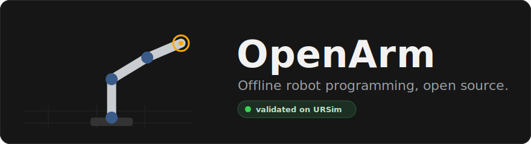

<p align="center">
  
</p>

# OpenArm

Free and open source offline programming for robot arms. Load a robot, teach a path,
check it for collisions, and export code that runs on the real controller. It's a
lighter, open alternative to the offline programming suites that cost a few thousand
dollars a seat.

Windows first, local first, MIT licensed. It's early alpha, but the code it generates
is already validated end to end against the official Universal Robots simulator.

## Demo


Teach a path, catch a collision, export URScript, run it in URSim. To record your own
clip, see [docs/CAPTURE.md](docs/CAPTURE.md).

## What it does

- Loads an industrial arm from a URDF and shows it in 3D. Ships with a UR5e.
- Jog the joints by hand, or drag a handle and let inverse kinematics reach the pose for you.
- Teach points and build a program from MoveJ, MoveL, waits, and digital outputs.
- Tune speed and corner blend per move, and work at the tool tip once you set a TCP.
- Flip between arm configurations (elbow up or down, wrist flipped) for the same pose.
- Import STEP, STL, and IGES parts to build a real workcell, with live collision checks as the arm moves.
- Replay the program in 3D, then export it to real robot code. URScript and ABB RAPID today.
- Save and load projects as plain JSON.
- Send a program straight to a UR controller or the free URSim simulator over TCP.

The program model doesn't know about any specific robot. Adding a new vendor is one
post-processor file plus one golden test, not a rewrite.

## Why

The paid tools are good, but most of what you pay for is the interface and a solid
post-processor, and neither of those should sit behind a seat license. So I'm building
an open one, starting with Universal Robots because their arms are everywhere in labs,
classrooms, and small shops.

## Safe to try

- No accounts, no telemetry, nothing phones home. The only network connection OpenArm makes is to the robot address you type into Send to robot.
- It emits plain text URScript, so you can read it before you run it.
- The whole flow is checked against URSim, so you can prove a program in simulation before it touches hardware.

Full details, including the steps for running on a real arm, are in [SECURITY.md](SECURITY.md).

## Quick start

```bash
npm install
npm run dev         # launch the app
npm test            # unit and golden-file tests
npm run typecheck
npm run build       # production build
```

## Try it against URSim (no hardware needed)

Install Docker Desktop, then start the free simulator:

```bash
docker run --rm -it -p 5900:5900 -p 6080:6080 -p 29999:29999 -p 30001-30004:30001-30004 \
  universalrobots/ursim_e-series
```

Open the sim at http://localhost:6080/vnc.html, then use Send to robot in OpenArm pointed
at 127.0.0.1:30002 and watch your program run. To check the whole pipeline in one command
(it powers on the sim, sends a program, and confirms the robot reaches the target from
realtime joint feedback):

```bash
npm run validate:ursim
```

## Build and release

OpenArm ships as a Windows installer built with electron-builder. There are no native
node modules, since OpenCascade and the math are wasm or pure JS, so packaging is plain
with no node-gyp and no ABI rebuilds.

```bash
npm run build:win     # electron-vite build, then electron-builder --win
```

The installer lands in `dist/OpenArm-<version>-setup.exe`. Drop an icon at
`build/icon.ico` (256 by 256) before a real release, otherwise the default Electron icon
is used.

Releases are meant to run in CI so they build on a clean machine:

- `ci.yml` runs typecheck, tests, and a build on every push and pull request.
- `release.yml` builds the installer on a Windows runner and attaches it to a GitHub Release when you push a tag:

```bash
npm version patch          # bumps the version and creates a tag
git push --follow-tags     # triggers the release build
```

There are no secrets to set up, since the workflow uses the built-in `GITHUB_TOKEN`.
Local installer builds sometimes fail while extracting winCodeSign because of a symlink
inside the zip, so letting CI build it is the easy path.

## How it's built

Electron with a React 19 renderer and three.js through react-three-fiber, bundled by
electron-vite. The robot loads through [urdf-loader](https://github.com/gkjohnson/urdf-loaders),
inverse kinematics is a small damped least squares solver over the loaded kinematics,
collisions run on three-mesh-bvh, and STEP import uses OpenCascade compiled to wasm. The
domain model and the post-processors are plain TypeScript in `src/shared` with no
framework imports, so they're easy to test.

## License

MIT © Wukoric LLC
